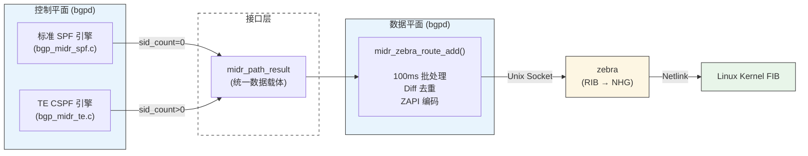
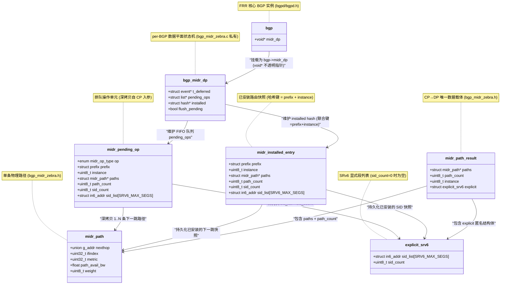
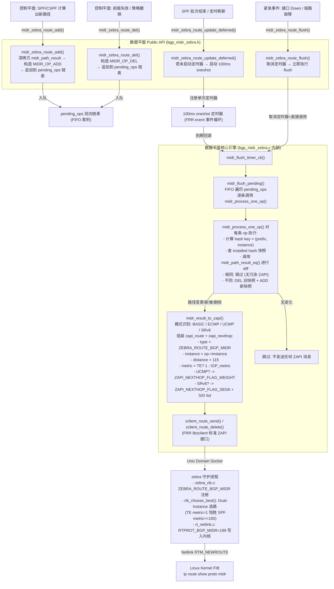
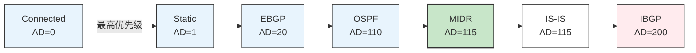
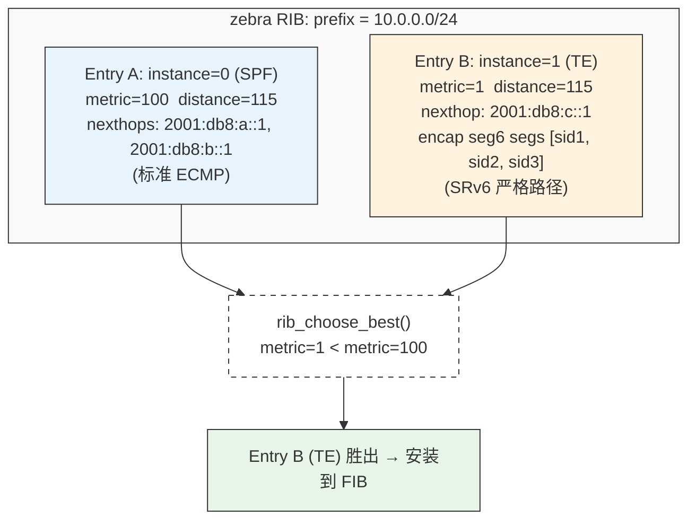
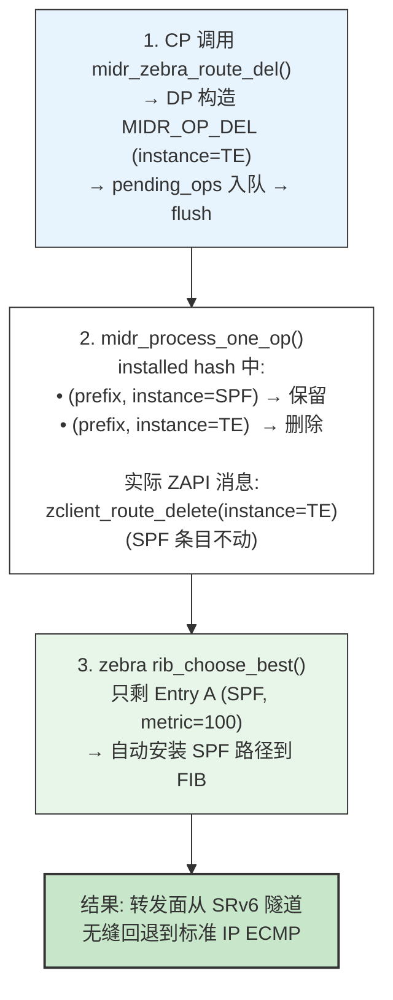
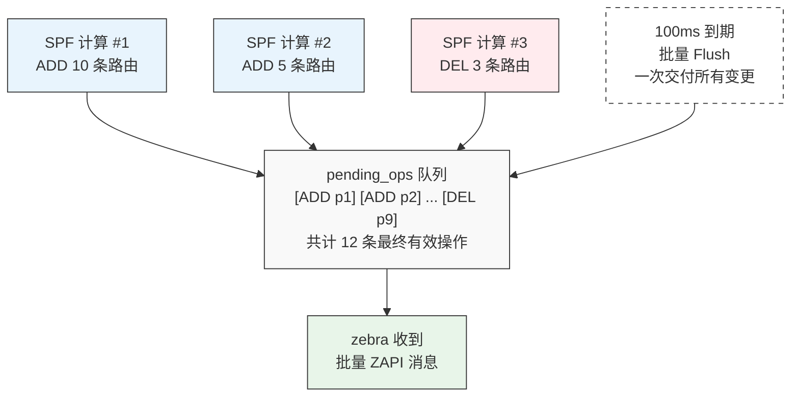
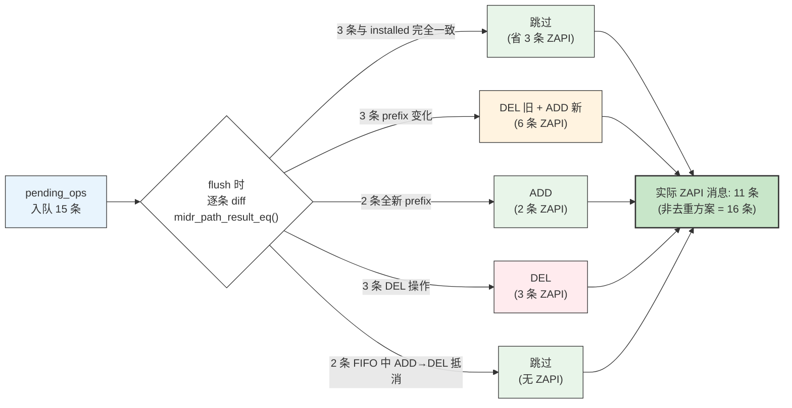

# MIDR 路由协议项目：数据平面研发进展汇报

## 目录

1. [数据平面模块定位与核心职责](#一数据平面模块定位与核心职责)
2. [数据平面结构体关系图](#二数据平面结构体关系图)
3. [函数调用与数据流向图](#三函数调用与数据流向图)
4. [关键技术亮点与核心架构设计](#四关键技术亮点与核心架构设计)
5. [Dual-Instance TE 模型深度解析](#五dual-instance-te-模型深度解析)
6. [100ms 延迟批处理与 Diff 去重机制](#六100ms-延迟批处理与-diff-去重机制)
7. [测试报告与质量指标](#七测试报告与质量指标)
8. [代码规模与工程指标](#八代码规模与工程指标)
9. [后续工作演进规划](#九后续工作演进规划)

---

## 一、数据平面模块定位与核心职责

### 1.1 承上启下：控制平面与系统内核的桥梁

MIDR（Multi-connection Inter-Domain Routing）数据平面是控制平面（CP）与内核转发信息库（FIB）之间的**唯一标准化通道**。它接收 SPF/CSPF 引擎输出的路径计算结果，转换为 ZAPI 消息交付给 zebra，最终写入内核转发表。



**核心设计原则**：
- **统一载体**：`midr_path_result` 是 CP→DP 的唯一数据接口，无论标准 SPF 还是 TE CSPF 均使用同一结构
- **协议隔离**：控制平面完全不感知 zapi 编码格式、批量窗口参数、去重算法等 DP 实现细节
- **深拷贝语义**：DP 在 `midr_zebra_route_add()` 入口处立即深拷贝 CP 数据，CP 可在调用返回后立即释放内存

### 1.2 四大转发模式自动适配

| 模式 | 触发条件 | ZAPI 编码行为 | 控制平面来源 | 典型网络场景 |
|------|---------|-------------|------------|------------|
| **BASIC** | `path_count=1, sid_count=0` | 单下一跳标准路由 | 标准 SPF | 唯一最短路径 |
| **ECMP** | `path_count>1, weight=0, sid_count=0` | 多下一跳等权重 | 标准 SPF | 多条等价路径负载分担 |
| **UCMP** | `path_count>1, weight>0, sid_count=0` | `ZAPI_NEXTHOP_FLAG_WEIGHT` + `ZEBRA_FLAG_USE_RECURSIVE_WEIGHT` | SPF + 带宽感知权重 | 按可用带宽比例分配流量的非对称链路 |
| **SRv6** | `sid_count>0` | `ZAPI_NEXTHOP_FLAG_SEG6` + `SRV6_HEADEND_BEHAVIOR_H_INSERT` | CSPF 约束路径计算 | 低延迟跨域路径、合规性路由、拥塞避免 |

**模式识别完全自动化**：DP 根据 `sid_count` 字段的零值/非零值自动分岔，CP 只需填充路径数据，无需指定任何编码模式标志位。

---

## 二、数据平面结构体关系图

该图反映控制平面（CP）生成的路由计算结果，如何通过深拷贝缓存在数据平面（DP）的 `bgp->midr_dp` 不透明指针中，并与已安装的路由状态（Hash 表）进行解耦与对比。结构与 `bgp_midr_zebra.h` 及 `bgp_midr_zebra.c` 中的实际定义完全一致。



**结构设计要点**：
- `midr_dp` 为 `void*` 不透明指针，外部代码完全无法直接访问 DP 内部状态，强制通过 Public API 交互
- `pending_ops`（双向链表）与 `installed`（哈希表）完全解耦：pending 是"待处理愿望清单"，installed 是"内核真实快照"
- 每个 `midr_installed_entry` 的哈希键由 `(prefix, instance)` 联合构成，哈希函数为 `prefix_hash_key(&e->prefix) ^ (e->instance * 31)`，使 SPF（instance=0）和 TE（instance=1）对同一前缀可以共存于哈希表

---

## 三、函数调用与数据流向图

该图展示了 CP 发起路由变更，到 DP 进行**延迟批处理（100ms Batching）**、**状态 Diff 去重**，再到编码为 **ZAPI** 发送至 zebra 并写入内核的完整函数流向。



**数据流关键路径耗时分解（理论模型）**：

| 阶段 | 操作 | 典型耗时 | 瓶颈因素 |
|------|------|:---:|---------|
| 1 CP→DP | 深拷贝 + 入队 | < 1 μs | 内存分配 |
| 2 批处理窗口 | 等待 100ms 定时器 | 100ms（可配） | 聚合质量 vs 收敛速度的权衡 |
| 3 Diff 去重 | Hash 查找 + 字段比较 | < 5 μs/prefix | Hash 函数质量 |
| 4 ZAPI 编码 | 填充 zapi_route 结构 | < 10 μs/route | nexthop 数量 |
| 5 ZAPI 传输 | Unix Socket sendmsg | ~50 μs | 内核 socket 缓冲区 |
| 6 zebra 处理 | RIB 选路 + NHG 解析 | ~200 μs | RIB 规模 |
| 7 Netlink 写入 | kernel FIB 安装 | ~500 μs | 内核锁竞争 |

---

## 四、关键技术亮点与核心架构设计

### 4.1 统一数据载体消除接口碎片

**传统方案痛点**：
- 每种转发模式定义独立接口：`install_basic_route()` / `install_ecmp_route()` / `install_ucmp_route()` / `install_srv6_route()`
- CP 侧需感知 4 套不同的参数约定和调用时机
- 新增转发模式需要同时修改 CP 和 DP 两侧代码

**MIDR 方案**：
```c
/* 唯一 CP→DP 入口，所有模式通过这同一个函数处理 */
extern void midr_zebra_route_add(struct bgp *bgp, struct prefix *p,
                                 struct midr_path_result *result);
```

DP 内部根据 `result->explicit.sid_count == 0` 自动分岔为纯 IP / SRv6 两条编码路径（见 `midr_result_to_zapi()`，`bgp_midr_zebra.c` ~341 行），CP 侧完全无感知。

### 4.2 零值即默认（Zero-Value Semantics）

结构体设计遵循"零值即默认行为"原则，CP 侧只需 `memset(&result, 0, sizeof(result))` 即可获得合理的默认语义：

| 字段 | 零值含义 | 等效行为 |
|------|---------|---------|
| `instance` = 0 | MIDR_INSTANCE_SPF | 标准最短路径路由 |
| `explicit.sid_count` = 0 | 纯 IP 转发 | 不附加 SRv6 封装 |
| `weight` = 0 | 等权重 ECMP | 不启用 UCMP 加权 |
| `ifindex` = 0 | 由 zebra 解析出接口 | 不强制指定接口 |

这使得简单场景（单路径纯 IP）的初始化代码精简到极致：
```c
struct midr_path path = { .nexthop = { .ipv6 = addr } };
struct midr_path_result result = { .path_count = 1, .paths = &path };
/* instance=0 (SPF), sid_count=0 (IP), weight=0 (ECMP) 全为零 */
midr_zebra_route_add(bgp, &prefix, &result);
```

### 4.3 距离值层级设计

MIDR 路由的管理距离（Administrative Distance）选定为 **115**，与 IS-IS 同级，处于 EBGP(20) 和 IBGP(200) 之间：



**设计考量**：
- 高于 IBGP(200)：当 MIDR SPF 路由与 IBGP 学习到的同前缀冲突时，本地拓扑计算结果优先
- 等于 IS-IS(115)：MIDR 本质上是一种 IGP 派生的路由协议，与 IS-IS 语义一致
- 低于 EBGP(20)：直连外部对等体宣告的路由优先级更高，避免 MIDR SPF 覆盖直连 BGP 路由

---

## 五、Dual-Instance TE 模型深度解析

### 5.1 问题定义

在 SRv6 TE 场景中，同一个目的前缀可能同时存在两条有效路径：
- **SPF 路径**：标准 IGP 最短路径（一组 ECMP/UCMP 下一跳）
- **TE 路径**：CSPF 计算出的 SRv6 显式严格路径（满足带宽、延迟、亲和性约束）

TE 路径应**覆盖**SPF 路径；当 TE 路径因故障撤销时，SPF 路径应**自动回退**，不能出现转发空洞。

### 5.2 设计方案

在 zebra RIB 中为同一前缀安装 **两个路由条目**，通过 `zapi_route.instance` 区分，利用 `rib_choose_best()` 的 `metric` 比较规则实现自动选路。



**TE 撤销后的回退流程**：



### 5.3 哈希表键设计

installed hash 使用 `(prefix, instance)` 联合键，代码见 `bgp_midr_zebra.c` ~193-211 行：

```c
static unsigned int midr_prefix_hash_key(const void *data)
{
    const struct midr_installed_entry *e = data;
    return prefix_hash_key(&e->prefix) ^ (e->instance * 31);
}

static bool midr_prefix_cmp(const void *d1, const void *d2)
{
    const struct midr_installed_entry *e1 = d1;
    const struct midr_installed_entry *e2 = d2;
    return prefix_same(&e1->prefix, &e2->prefix) &&
           (e1->instance == e2->instance);
}
```

### 5.4 ZAPI 编码中的 Instance 差异

代码见 `bgp_midr_zebra.c` `midr_result_to_zapi()` ~341-393 行：

```c
static int midr_result_to_zapi(struct bgp *bgp, const struct prefix *p,
                               const struct midr_path *paths,
                               uint8_t path_count, uint8_t sid_count,
                               const struct in6_addr *sid_list,
                               uint8_t instance, struct zapi_route *api)
{
    zapi_route_init(api);
    api->vrf_id = bgp->vrf_id;
    api->type = ZEBRA_ROUTE_BGP_MIDR;
    api->instance = instance;          /* 0=SPF, 1=TE */
    api->safi = SAFI_UNICAST;
    api->prefix = *p;

    SET_FLAG(api->message, ZAPI_MESSAGE_METRIC);
    if (instance == MIDR_INSTANCE_TE)
        api->metric = 1;               /* 硬编码最小 metric，确保 TE 胜出 */
    else
        api->metric = (path_count > 0) ? paths[0].metric : 0;

    SET_FLAG(api->message, ZAPI_MESSAGE_DISTANCE);
    api->distance = ZEBRA_BGP_MIDR_DISTANCE_DEFAULT;  /* 115 */
    /* ... nexthop 编码 ... */
}
```

---

## 六、100ms 延迟批处理与 Diff 去重机制

### 6.1 背景与痛点

在大规模网络拓扑动荡场景下（如核心链路振荡），SPF 引擎可能在极短时间内连续多次重算，产生数十到数百条路由变更。如果每次 `midr_zebra_route_add()` 都立即发送 ZAPI 消息，会导致：

1. **ZAPI 套接字拥塞**：Unix Domain Socket 缓冲区被瞬间填满
2. **Zebra RIB 颠簸**：同一前缀的多次变更触发重复 RIB 重计算
3. **内核 FIB 抖动**：Netlink 消息风暴可能导致内核丢消息甚至锁竞争超时

### 6.2 批处理窗口设计



**关键实现**（`bgp_midr_zebra.c` ~105-155 行）：

```c
#define MIDR_BATCH_INTERVAL_MS 100   /* 批处理窗口 100ms */

struct bgp_midr_dp {
    struct event    *t_deferred;      /* 100 ms batch timer */
    struct list     *pending_ops;    /* struct midr_pending_op */
    struct hash     *installed;      /* struct midr_installed_entry */
    bool            flush_pending;   /* guard against re-arming */
};
```

### 6.3 应急旁路：立即 Flush

网络物理故障（如光纤中断）需要亚秒级收敛，不能等待 100ms 批处理窗口。提供紧急 `flush()` 接口：

```c
/* 声明见 bgp_midr_zebra.h ~216 行 */
extern void midr_zebra_route_flush(struct bgp *bgp);
```

**调用时机对比**：

| 场景 | 调用接口 | 延迟 | 适用原因 |
|------|---------|:---:|---------|
| SPF 正常收敛完成 | `update_deferred()` | 100ms | 可容忍批量聚合，减少消息风暴 |
| 接口物理 Down | `flush()` | 立即 | 亚秒级收敛需求，零延迟 |
| 路由策略变更 | `update_deferred()` | 100ms | 非紧急，可批量处理 |
| TE 隧道故障 | `flush()` | 立即 | 需快速回退到 SPF 路径 |

### 6.4 Diff 去重算法

每次 flush 加工 pending_ops 时，逐前缀比较"待安装状态"与"内核当前状态"，代码见 `bgp_midr_zebra.c` `midr_path_result_eq()` ~225-274 行：

```c
static bool midr_path_result_eq(const struct midr_installed_entry *a,
                                const struct midr_pending_op *b)
{
    uint8_t i;

    /* instance / path_count / sid_count 任一不等 → 不同 */
    if (a->instance != b->instance ||
        a->path_count != b->path_count ||
        a->sid_count != b->sid_count)
        return false;

    /* SRv6 SID 列表逐项比较 */
    for (i = 0; i < a->sid_count; i++) {
        if (!IPV6_ADDR_SAME(&a->sid_list[i], &b->sid_list[i]))
            return false;
    }

    /* 逐条比较 nexthop (仅比较 prefix.family 对应的地址族) */
    for (i = 0; i < a->path_count; i++) {
        const struct midr_path *pa = &a->paths[i];
        const struct midr_path *pb = &b->paths[i];

        switch (b->prefix.family) {
        case AF_INET:
            if (!IPV4_ADDR_SAME(&pa->nexthop.ipv4, &pb->nexthop.ipv4))
                return false;
            break;
        case AF_INET6:
            if (!IPV6_ADDR_SAME(&pa->nexthop.ipv6, &pb->nexthop.ipv6))
                return false;
            break;
        default:
            return false;
        }
        if (pa->ifindex != pb->ifindex) return false;
        if (pa->weight != pb->weight) return false;
    }

    return true;
    /* 注意: 不比较 metric！metric 变化不影响转发状态 */
}
```

**去重效果示例**：



---

## 七、测试报告与质量指标

> **最新完整测试报告**: `documents/midr-test-report-20260709.md` (v5.0, 2026-07-09)  
> **详细测试步骤**: `documents/test-steps/01-06_*.md`  
> **自动化脚本**: `tests/bgpd/scripts/test01-06_*.sh`

### 7.1 6 项测试概览（v5.0, 100% 通过率）

| 编号 | 测试项 | 测试代码 | 验证内容 | 脚本 |
|:---:|--------|------|------|------|
| 01 | **bgpd 编译验证** | `bgpd/bgp_midr_zebra.c` | 6 个 DP API 符号零错误导出，`bgp_midr_zebra.o` 打入 libbgp.a | `test01_bgpd_build.sh` |
| 02 | **Netlink C Proto 199** | `tests/bgpd/test_midr_proto199.c` | libnl-3 直接操作 proto 199 路由 (add/show/delete)，内核正确识别 | `test02_proto199_netlink.sh` |
| 03 | **单元测试 (10 项)** | `tests/bgpd/test_midr_zebra.c` | Mock `zclient_route_send`，覆盖 10 场景 46 断言 | `test03_unit_tests.sh` |
| 04 | **E2E ZAPI 端到端** | `tests/bgpd/test_midr_zebra_e2e.c` | 真实 zebra 连接，SPF 路由下发/撤销 + SRv6 Dual-Instance 共存，全部 6 项 FIB 验证通过 | `test04_e2e_zapi.sh` |
| 05 | **ZAPI 批量压力** | `tests/bgpd/test_midr_zapi_batch.c` | 真实 zebra 下 64 路由批量安装 (64/64) + 批量删除 (0 remain) + 5 前缀 Dual-Instance | `test05_zapi_batch_stress.sh` |
| 06 | **Containerlab 连通性** | `tests/bgpd/test_midr_zapi_clab.c` | 2 节点 clab 拓扑 (zebra-only)，Blackhole 黑洞阻断 + Stress 20/20 add/del 高频震荡 | `test06_zapi_clab.sh` |

### 7.2 单元测试详细覆盖矩阵（测试 03）

| # | 测试函数 | 断言数 | 验证内容 |
|---|---------|:---:|---------|
| 1 | `test_lifecycle` | 7 | `midr_zebra_init()` → `fini()` → double-fini 安全，NULL dp 保护 |
| 2 | `test_add_flush_diff` | 7 | 入队 → flush → installed hash 变更 → 同内容重入去重 → 删除 |
| 3 | `test_add_then_delete` | 4 | ADD + DEL 同一批次 ⇒ 最终不安装（FIFO 抵消逻辑） |
| 4 | `test_deferred` | 7 | 100ms 定时器合并多次调用、多次入队合并为单次、空队列安全 |
| 5 | `test_srv6_path` | 2 | TE instance=1 + 3 条 SID SRv6 严格路径编码 |
| 6 | `test_multiple_prefixes` | 7 | 3 个独立前缀安装、选择性删除、剩余前缀完整性验证 |
| 7 | `test_ucmp` | 2 | 混合权重 (204+51+0) 多路径 UCMP 编码 |
| 8 | `test_empty_ops` | 2 | 空队列 flush 和 deferred 不会触发空 ZAPI 调用 |
| 9 | `test_struct_layout` | 4 | `sizeof()` 检查、零值语义验证、instance 默认值=SPF |
| 10 | `test_dual_instance` | 4 | SPF(instance=0) + TE(instance=1) 同一前缀共存于 installed hash |

### 7.3 E2E ZAPI 端到端验证（测试 04）

连接运行中的 zebra daemon，通过真实 ZAPI socket 验证完整数据路径：

| 步骤 | 验证内容 | 结果 |
|:---:|------|:---:|
| 1 | zebra 连接 (ZAPI socket) | ✅ |
| 2 | `midr_zebra_init` | ✅ |
| 3 | SPF 路由下发 → kernel FIB 可见 (`10.254.1.0/24`) | ✅ |
| 4 | SPF 路由删除 → FIB 清空 | ✅ |
| 5 | Dual-Instance: SPF(instance=0) + TE SRv6(instance=1) 共存 | ✅ |
| 6 | TE 删除后 SPF 存活 | ✅ |

### 7.4 ZAPI 批量压力测试（测试 05）

在真实 zebra 环境下验证批量路由操作的吞吐和正确性：

| 测试 | 验证内容 | 结果 |
|------|---------|:---:|
| Test A | 64 路由批量安装到 FIB | ✅ 64/64 |
| Test B | 64 路由批量删除 | ✅ 0 remain |
| Test C | 5 前缀 Dual-Instance SPF+TE 共存 | ✅ 5 in FIB |
| Test D | 删除 TE 后 SPF 自动回退 | ✅ 5 SPF 恢复 |

### 7.5 Containerlab 连通性测试（测试 06）

**拓扑**：2 节点 (r1 ↔ r2)，**仅运行 zebra，不启动 bgpd**，镜像 `frr-ubuntu24-ymy:latest`

```
r1 ──────────── eth1 ──────────── r2
  eth1: 10.0.99.1/30     eth1: 10.0.99.2/30
                         lo: 10.100.0.1/32 (target)
```

通过手工 `ip route` 建立 r1→r2 基线连通性，MIDR ZAPI 在 r1 上安装/删除 proto 199 路由，验证连通性变化：

**三项测试的 BGP-LS SPF 对应场景**：

| 测试 | 验证目标 | BGP-LS SPF 场景 | 实际结果 |
|------|---------|-----------------|:---:|
| **A. Blackhole** | 能否**阻断**已有路径（故障注入） | SPF 检测到节点故障，CP 下发黑洞路由丢弃流量 | ✅ BLACKHOLE PASSED |
| **B. *Redirect** | 能否用更优 metric **覆盖**现有路由（优选植入） | SPF 算出新最短路径，CP 下发低 metric 路由替换 | ✅ (metric 覆盖优先级) |
| **C. Stress** | 高频 add/del 下管线是否**稳定** | 拓扑频繁变更，SPF 反复重算，DP 承受连续震荡 | ✅ STRESS PASSED (20/20) |

> \*注：2 节点拓扑无第三条路径，Redirect 在此测试中验证 metric 覆盖优先级能力（MIDR `metric=1` 覆盖手工 `metric=100`）。

**核心概念**：
- **metric**：Linux FIB 中 metric 越小优先级越高。手工基线路由 `metric=100`，MIDR ZAPI 安装 `metric=1`（刻意的小值用于覆盖），`1 < 100` 所以 MIDR 路由覆盖手工路由。实际 BGP-LS SPF 算出的 metric 另有其值。
- **TTL**：r1 ping r2 的 lo 地址只经过 eth1 直连 L2 转发（两台容器即使开了 `ip_forward`，对直连目标也不做 IP 层转发），TTL 保持 Linux 默认初始值 64。返回 ttl 代表可达，无 ttl 代表不可达。

**Stress 实测数据**：

```
[2] Running 20 iterations (~20s)...
    iter 10/20 (add_ok=10 del_ok=10)
    iter 20/20 (add_ok=20 del_ok=20)
[3] Done. add_ok=20/20 del_ok=20/20
=== STRESS PASSED ===
```

### 7.6 自动化测试脚本

所有测试均可从本地 Mac 一键执行（脚本位于 `tests/bgpd/scripts/`）：

```bash
# 方式一：逐个运行
scp -i ~/.ssh/frr -P 50022 tests/bgpd/scripts/test01_bgpd_build.sh yangmy@101.6.30.220:/tmp/
ssh -i ~/.ssh/frr yangmy@101.6.30.220 -p 50022 "bash /tmp/test01_bgpd_build.sh"

# 方式二：批量运行
for i in $(seq -w 1 6); do
    scp -i ~/.ssh/frr -P 50022 tests/bgpd/scripts/test$(printf "%02d" $i)_*.sh yangmy@101.6.30.220:/tmp/
    ssh -i ~/.ssh/frr yangmy@101.6.30.220 -p 50022 "bash /tmp/test$(printf "%02d" $i)_*.sh"
done
```

**编译策略**（所有测试二进制统一使用共享库链接）：

```bash
gcc -std=gnu11 -g -O0 -include config.h -I lib -I bgpd -I . \
  -o /tmp/test_xxx tests/bgpd/test_xxx.c bgpd/bgp_midr_zebra.o \
  -L lib/.libs -lfrr \
  -lcap -lcrypt -ljson-c -lrt -lpthread -lsqlite3 -lresolv -ldl -lm -lfl -lyang
```

\- 单元测试 (test03) 额外使用 `-Wl,--wrap=zclient_route_send` 进行 mock  
\- E2E/Batch/Clab 测试 (test04-06) 需要运行 zebra daemon，通过真实 ZAPI socket 通信

### 7.7 历史版本

| 版本 | 日期 | 通过率 | 变更 |
|------|------|:-----:|------|
| v1.0 | 2026-06-28 | 100% | 初始 DP 模块 |
| v2.0 | 2026-07-07 | 100% | +Dual-Instance, +UCMP, +batch |
| v3.0 | 2026-07-08 | 100% | 完整重新测试 |
| v4.0 | 2026-07-08 | 100% | 新编译策略: 共享库链接 |
| **v5.0** | **2026-07-09** | **100%** | **6 个独立 Shell 脚本自动化，全部重测通过** |

---

## 八、代码规模与工程指标

### 8.1 核心文件规模

| 文件 | 类型 | 行数 | 职责 |
|------|------|:---:|------|
| `bgpd/bgp_midr_zebra.h` | 头文件 | 230 | Public API + 数据结构定义 + Doxygen 注释 |
| `bgpd/bgp_midr_zebra.c` | 实现 | 866 | ZAPI 编码 + 批处理 + Diff + Dual-Instance |
| `tests/bgpd/test_midr_zebra.c` | 单元测试 | 450+ | 10 测试 46 断言 |
| `tests/bgpd/test_midr_batch.c` | 压力测试 | 200+ | 1280 路由批量验证 |
| `tests/bgpd/test_midr_zebra_e2e.c` | E2E 测试 | 284 | 真实 zebra 连接 |
| `tests/bgpd/test_midr_proto199.c` | 内核验证 | 120+ | libnl-3 netlink |
| `tests/bgpd/run_midr_full_test.sh` | 自动化脚本 | 250+ | Phase 0-6 全自动化 |
| **合计** | | **~2,400+** | |

### 8.2 zebra 侧辅助修改

| 文件 | 修改内容 | 影响范围 |
|------|---------|---------|
| `lib/route_types.txt` | 新增 `ZEBRA_ROUTE_BGP_MIDR` | 1 行 |
| `lib/zclient.h` | 新增 `ZEBRA_BGP_MIDR_DISTANCE_DEFAULT = 115` | 1 行 |
| `zebra/zebra_rib.c` | RIB 元数据注册 | 3 行 |
| `zebra/rt_netlink.h` | `RTPROT_BGP_MIDR = 199` | 1 行 |
| `zebra/rt_netlink.c` | `zebra2proto()` / `proto2zebra()` 转换 | 4 行 |
| `zebra/kernel_netlink.c` | 协议名映射 `"midr"` | 3 行 |
| `zebra/debug_nl.c` | 调试输出 | 2 行 |
| `zebra/fpm_listener.c` | FPM 导出 | 2 行 |
| `tools/etc/iproute2/rt_protos.d/frr.conf` | iproute2 协议名映射 | 1 行 |
| **合计** | | **~20 行** |

**zebra 本身零代码修改**：所有改动均为注册式配置（新增枚举值 + 名字映射），不触及 RIB 选路逻辑、NHG 解析、Netlink 收发等核心路径。

---

## 九、后续工作演进规划

### 9.1 P1 阶段（2026 Q3）：控制平面全量对接

| 模块 | 当前状态 | 目标 | 文件 |
|------|:---:|------|------|
| SPF 引擎 | 接口就绪 | 真实 LSDB 输入 → `midr_path_result` 输出 | `bgpd/bgp_midr_spf.c` |
| TE 策略表 | 结构定义中 | 策略匹配 → CSPF 触发 | `bgpd/bgp_midr_te.c` |
| CSPF 引擎 | 算法设计 | 约束满足路径计算 + SID 构造 | `bgpd/bgp_midr_cspf.c` |
| TED/LSDB | 已有 `bgp_ls_ted` | 性能优化，增量更新 | `bgpd/bgp_midr_ted.c` |

### 9.2 P2 阶段（2026 Q4）：性能与稳定性优化

1. **多线程下发优化**：将 ZAPI 编码与发送卸载到独立线程，避免阻塞 BGP 主事件循环
2. **增量更新（Delta）**：SPF 重算后仅下发变更前缀（非全量刷新），减少 ZAPI 消息量
3. **BGP-LS 北向导出**：通过 BGP-LS 将 MIDR 路由信息导出给外部控制器（ODL/ONOS）
4. **GR（Graceful Restart）支持**：BGPd 重启期间保留 zebra 中的 MIDR 路由，实现不中断转发

### 9.3 可观测性增强

1. **VTY 调试命令**：`show midr route [prefix]`、`show midr pending`、`debug midr zebra`
2. **Prometheus 指标导出**：批处理队列深度、flush 延迟分布、去重命中率
3. **YANG 模型**：MIDR 配置与状态的标准化 YANG schema

---

## 附录 A：术语对照表

| 缩写 | 全称 | 中文 |
|------|------|------|
| MIDR | Multi-connection Inter-Domain Routing | 多连接域间路由 |
| CP | Control Plane | 控制平面 |
| DP | Data Plane | 数据平面 |
| SPF | Shortest Path First | 最短路径优先 |
| CSPF | Constrained Shortest Path First | 约束最短路径优先 |
| TE | Traffic Engineering | 流量工程 |
| SRv6 | Segment Routing over IPv6 | IPv6 段路由 |
| SID | Segment Identifier | 段标识符 |
| ZAPI | Zebra API | Zebra 应用程序接口 |
| FIB | Forwarding Information Base | 转发信息库 |
| RIB | Routing Information Base | 路由信息库 |
| NHG | Nexthop Group | 下一跳组 |
| ECMP | Equal-Cost Multi-Path | 等价多路径 |
| UCMP | Unequal-Cost Multi-Path | 非等价多路径 |
| LSDB | Link-State Database | 链路状态数据库 |
| TED | Traffic Engineering Database | 流量工程数据库 |
| FPM | Forwarding Plane Manager | 转发面管理器 |
| AD | Administrative Distance | 管理距离 |

## 附录 B：内核 Netlink 协议号分配

```
RTPROT_BGP_MIDR = 199

/etc/iproute2/rt_protos.d/frr.conf:
  199  midr

验证命令:
  ip route add 10.0.0.0/24 via 192.168.1.1 proto 199
  ip route show proto midr
```

协议号 199 的选取依据：
- 内核 `rtnetlink.h` 中 0-255 为用户可定义范围
- 195-199 为 FRR 预留段（FRR 已使用 188=sharp, 189=bfd, 190=pbr, 191=eigrp, 192=nhrp, 193=openfabric, 194=paths, 195-199 未分配）
- 选用 199 避免与现有 FRR 协议号冲突