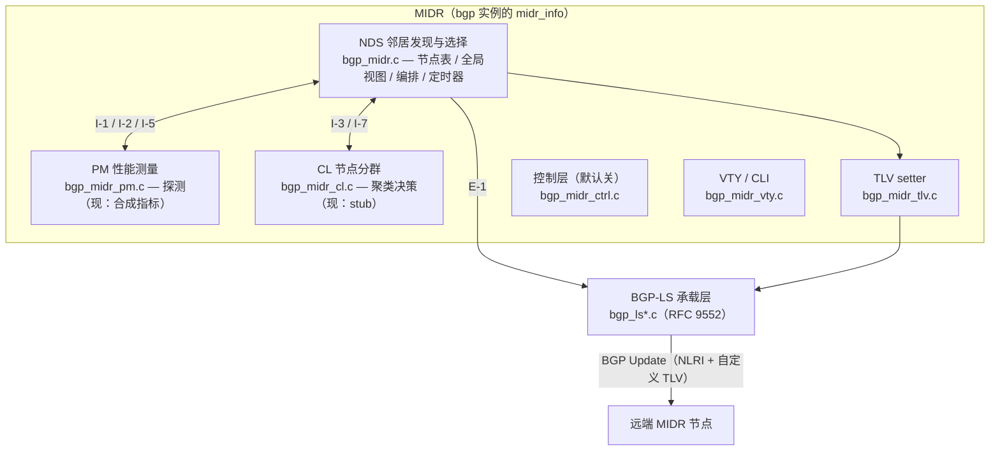
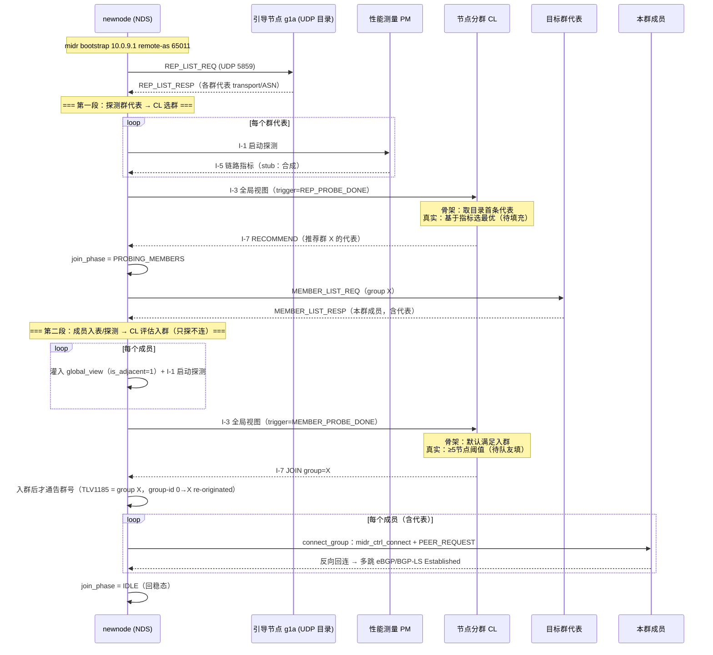
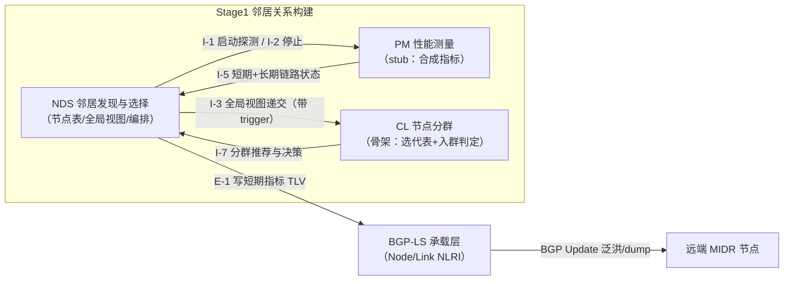
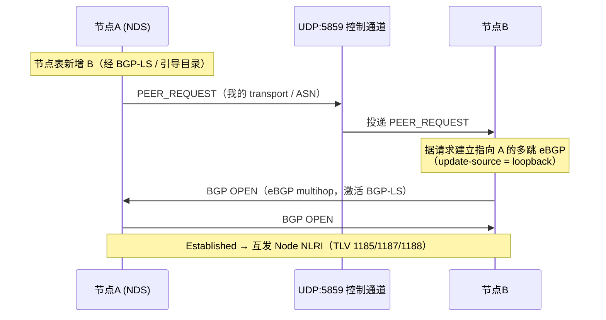
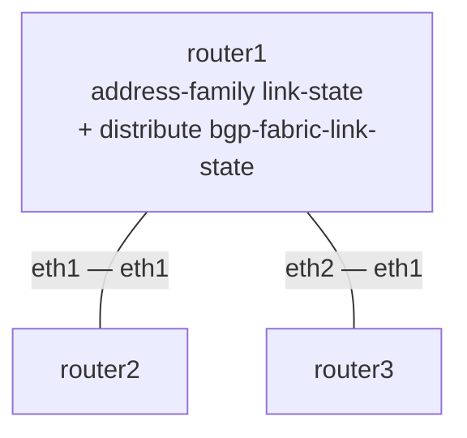
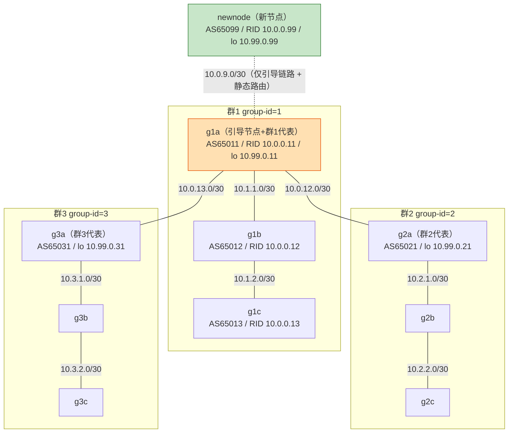

# MIDR 说明与对接文档 v1

---

## §0 总览与落地边界

### 0.1 模块地图

MIDR 状态整体挂在 `bgp->midr_info`（`struct bgp_midr`），与 BGP-LS 的 `bgp->ls_info` 平级。模块按 **NDS / PM / CL / E-1** 划分：



### 0.2 新增文件清单（凡 `bgp_midr*` / `bgp_neighbor_store*` 都是本项目新增）

| 文件 | 职责 | 现状 |
|------|------|------|
| `bgpd/bgp_midr.{c,h}` | **NDS 核心**：节点表、全局视图、本地身份、keepalive/expire 定时器、新节点加入编排 | 可运行 |
| `bgpd/bgp_midr_pm.{c,h}` | **PM 性能测量**：UDP 探测 / EWMA 等 | **占位**：合成指标 |
| `bgpd/bgp_midr_cl.{c,h}` | **CL 节点分群**：聚类决策 | **占位**：日志 + join 时随机选群 |
| `bgpd/bgp_midr_tlv.{c,h}` | **TLV setter**：只负责“填 `bgp_ls_attr` 字段 + 置 present 位”，**不含 wire 编解码** | 可运行 |
| `bgpd/bgp_midr_ctrl.{c,h}` | **控制层**：按节点表自动建/拆 eBGP 会话（不在 NDS/PM/CL 设计内） | **默认关**：自动 peering 的调用入口在代码里被注释、未启用 |
| `bgpd/bgp_midr_vty.{c,h}` | **VTY / CLI**：`midr ...` / `show midr ...` 命令 | 可运行 |
| `bgpd/bgp_neighbor_store.{c,h}` | SQLite 持久化邻居能力/链路缓存 | **已搁置：暂未使用、不再维护**（接手不必投入） |

> §7 讲的是**对原始 FRR 文件的改动**，与本清单的“新增文件”互补，合起来是完整改动全貌。

### 0.3 落地边界（已接通 vs 占位）

| 状态 | 内容 |
|------|------|
| ✅ **已接通并运行** | NDS 节点表 + 自通告/老化；BGP-LS 收发包 + MIDR 自定义 TLV；分层发现（引导目录 + 群代表成员表）；**I-3 / I-5 整条流水线**（PM 推合成指标、CL 回调被触发，端到端能跑） |
| ⚠️ **仅占位逻辑** | PM 真实探测（现为合成指标）；CL 真实聚类（多为日志，仅 join 时随机选群）；E-1 的 1186 Link NLRI **已端到端发出/传播**，但携带的是 PM 合成指标（编码口径待对齐 spec，见 §7.5(2)） |
| ❌ **未接通 / 待办** | 只读 getter；控制层自动 peering（默认关）。详见 §8 |

### 0.4 阅读路线

- **只想跑起来** → §1（构建/部署） + §6（拓扑/实验）。
- **接手填 PM / CL** → §4（接缝、填哪里） + §5（机制）。
- **负责其他大模块（如 ④ 洪泛控制）** → §3（数据流） + §4（E-1 / 全局视图对接点）。
- **与原始 FRR的差异及与最初设计的部分差异** → §7 + §7.5。

---

## §1 快速上手

### 1.1 构建（autotools，在 `frr/` 目录下）

```bash
#编译本地文件
cd frr
./bootstrap.sh && ./configure <你的选项> && make        # 首次完整构建，如下所示

./bootstrap.sh
./configure \
--prefix=/usr \
--includedir=\${prefix}/include \
--bindir=\${prefix}/bin \
--sbindir=\${prefix}/lib/frr \
--libdir=\${prefix}/lib/frr \
--libexecdir=\${prefix}/lib/frr \
--localstatedir=/var/run/frr \
--sysconfdir=/etc/frr \
--with-moduledir=\${prefix}/lib/frr/modules \
--enable-configfile-mask=0640 \
--enable-logfile-mask=0640 \
--enable-snmp=agentx \
--enable-multipath=64 \
--enable-user=frr \
--enable-group=frr \
--enable-vty-group=frrvty \
--with-pkg-git-version \
--disable-doc \
--enable-config-rollbacks 			#用于引入SQLITE 数据库的，不过现在搁置了，放着没关系

make -j$(nproc)						

#上述是针对首次编译的，下面的针对改动了代码的情况
make bgpd/bgpd -j$(nproc)           #若只改动了bgpd下的文件，注意是改动而不是新增
make vtysh/vtysh -j$(nproc)			#同上，这次的文件包括bgpd下的bgp_midr_vty.c文件，用于写命令的

#若新增了文件则需要重新configure再执行上述的两行
```

**两个容易忽略的点：**

1. **新增/改动 `bgpd/*.c`、`bgpd/*.h` 必须同步登记进 `bgpd/subdir.am`**（`*_SOURCES` 与 `noinst_HEADERS` 两处）。改了 `subdir.am` 后直接 `make` 即可，构建系统会自动重生成 Makefile。漏登记 → 新文件不参与编译/链接。
2. **改了 CLI（新增/改 `DEFUN`）要重新生成 vtysh 命令表**，否则 `vtysh` 里看不到新命令（`make` 会触发 clippy/vtysh_cmd 重生成；若异常先 `make -C frr clean` 再来）。

### 1.2 搭实验环境（containerlab）

拓扑由 **[containerlab](https://containerlab.dev)** 管理——需要先装：
用于管理多容器的	

```bash
# 安装 containerlab（官方一键脚本）
bash -c "$(curl -sL https://get.containerlab.dev)"
clab version          # 验证
```

还需要一个名为 `frr-ubuntu20:latest` 的容器镜像（内含编译好的 bgpd）。建议**各自本地构建**，不把镜像本身放进仓库（镜像体积大、不适合 git）。两步：

```bash
# Ⅰ 基础镜像（Dockerfile 在 frr/docker/ 下，随仓库一并提供），后续部署拓扑时，实验用的容器都基于这个镜像
cd frr
sudo docker build -t frr-ubuntu20:latest \
    --build-arg=UBUNTU_VERSION=20.04 \
    -f docker/ubuntu-ci/Dockerfile .

# Ⅱ（可选）在其上追加工具，仍打同一 tag，这个dev文件位置任意，注意它是在现有镜像基础上补充几个工具，但不会作用到现有容器中，若想生效则需要重新构建容器
docker build -f Dockerfile.dev -t frr-ubuntu20:latest .
```

第Ⅱ步的 `Dockerfile.dev` 很简单（追加 sqlite/vim 等；其中 sqlite 本是给已搁置的 `neighbor_store` 用的，可省）：

```dockerfile
FROM frr-ubuntu20:latest
USER root
RUN apt-get update && apt-get install -y libsqlite3-dev sqlite3 vim python3-dev \
    && rm -rf /var/lib/apt/lists/*
```

各节点的 `frr.conf` / `daemons` 在 `containerlab/configs*/` 下，由拓扑文件 bind 进容器。

### 1.3 部署与验证

- **【重要】**：如果你需要在本地跑实验，那么在你电脑关机，那些拓扑就失效了，下次运行时需要重新跑一遍，也就是先destroy & deploy再cp和restart

```bash
clab deploy -t containerlab/midr-join.clab.yaml    # 10 节点：分层发现/新节点加入主场景，部署用
# 或
clab deploy -t containerlab/topo.clab.yaml         # 3 节点：BGP-LS 基础验证

docker exec -it clab-midr-join-newnode vtysh       # 进某节点
clab destroy -t containerlab/midr-join.clab.yaml 	#销毁用

#下述是实验时常用的命令or流程
#销毁再重新部署，直接引入新拓扑
cd containerlab && clab destroy -t midr-join.clab.yaml && clab deploy -t midr-join.clab.yaml

#当你改动了本地的代码时，若想作用到容器中，一个是重构镜像然后再执行上述的destroy和deploy，但很慢。另一个是把改后代码复制到现有容器中再重启，如下所示
cd frr
    for n in g1a g1b g1c g2a g2b g2c g3a g3b g3c newnode; do
      c=clab-midr-join-$n
      docker cp bgpd/.libs/bgpd   $c:/usr/lib/frr/bgpd
      docker cp vtysh/.libs/vtysh $c:/usr/bin/vtysh
      docker exec -u root $c /usr/lib/frr/frrinit.sh restart
    done
```

进 `vtysh` 后的常用命令：

| 命令 | 作用 |
|------|------|
| `show midr nodes` | 看本节点学到的所有 MIDR 节点（router-id / group-id / 能力 / transport / last-seen） |
| `show midr neighbors` | 列所有激活了 BGP-LS 的 peer，显示上存在些问题，但不影响使用吗，也不是错误，详见[1.4 部分命令说明](#14-部分命令说明) |
| `show midr join` | 看新节点加入流程的进度/状态 |
| `midr help [plain]` | MIDR 命令一览（默认彩色，`plain` 走纯文本） <br />需要先部署`docker exec -it clab-midr-join-newnode vtysh -c "midr help"` |
| `debug bgp midr [discovery]` | 打开 MIDR 大流程 / 分层发现调试频道 |
| `debug bgp linkstate` | 看 BGP-LS 以及 PM/CL stub 日志 |

**命令在哪个模式用**：`midr help [plain]` 可查看 MIDR 命令一览（含各自所在模式）

### 1.4 部分命令说明

- 下述是 `watch -n 1 "docker exec clab-midr-join-g1a vtysh -c 'show midr neighbors'"`的结果，用于定时查看neighbors，按照 [6.3 两套拓扑](#63-两套拓扑)的内容，本应是只有三个邻居——g1b(65012)，g2a(65021)，g3a(65031)，也就是前三条，但多了几条——g1b(65012)，g1c(65013)，newnode(65099)，即后三条
  - newnode是正常的：我把newnode的引导节点设置为了g1a，newnode会加入群1然后和群成员建连
    - 注意：现在我把newnode的frr.conf中的引导节点那栏注释了，若想手动体验设置引导节点，可执行下述命令，亦或是解除注释
    - `docker exec clab-midr-join-newnode vtysh -c "conf t" -c "router bgp 65099" -c "midr bootstrap 10.0.9.1 remote-as 65011"`
  - g1c：当前代码有个机制，就是会在得知新节点的信息时判断它是否值得peer，当前的策略是主要是同组的就peer，而在静态配置中没有把1c设置为邻居，所以这个机制起效了
  - g1b：这个是显示上的问题，后续需要改动
    - 原因：我没有做好接口地址和transport-address（10.99.x.x的那个）的区分


- 其他的命令有的是早期设置的，有的没验证了，如果有问题请通知下

### 1.5 查看日志

```bash
#查看newnode的日志
docker exec -it clab-midr-join-newnode vtysh

#进入后
debug bgp midr 		#查看midr相关日志，no debug bgp midr即可关闭
debug bgp link-state #查看bgp相关日志，同上
terminal monitor	#开始打印日志
```


---

## §2 数据结构与 TLV

### 2.1 身份 / 定位解耦（重要前提）

MIDR 把“**节点身份**”和“**可达地址**”分开：

- **身份 = router-id**（节点 IP），作节点表的哈希键。原因：BGP-LS 的 WITHDRAW（MP_UNREACH）**只带 NLRI、不带属性**，撤销时拿不到 transport 地址，所以键必须是 NLRI 自带的 router-id。
- **可达地址 = transport-address（TLV 1188）**：真正用于**建连 / 探测 / 展示**的地址（实际填节点的 **loopback**）。它是属性、可变，与身份解耦——地址变了身份不变。节点未通告时回落到 router-id。

### 2.2 核心结构（均在 `bgp_midr.h`）

```c
struct midr_node_entry {            	//is_adjacent是新增的
    bool is_adjacent;                  /* 仅泛洪/仅探测未纳入=false；已决定纳入为邻居=true。
                                           （稳态发现里 should_peer 通过才置 true，探测本身不自动置；
                                           join 第二段一进来即已决定评估整群，learn 时即 true。）
                                           CL/PM 的"邻居质量全图"只看 true 子集。
                                           与 on_node_nlri 逐字段更新正交，泛洪不会清掉它。 */

};
```

```c
enum midr_join_phase {                   /* 【本次新增】加入流程当前阶段。
                                           仅用于 on_cluster_decision 幂等 guard + show midr join；
                                           trigger 由编排层"探完一批"后显式发，不在此推导。 */
    MIDR_JOIN_IDLE = 0,                 /* 未在加入流程（稳态） */
    MIDR_JOIN_PROBING_REPS,             /* 正在探测群代表 */
    MIDR_JOIN_PROBING_MEMBERS,          /* 正在探测目标群成员 */
};
```

- `join_phase`（加入阶段，**本次新增**）
- `midr_node_entry` 新增 `is_adjacent` 字段（**本次新增**）详见代码
  - global-view中的nodes存的是认识的节点而非邻居，所以靠is_adjacent来判断是否是邻居

### 2.3 自定义 TLV 全表

字段与 present 位定义在 `bgp_ls_nlri.h`；**wire 编解码实现在 `bgp_ls_nlri.c`**（编码 / 解码 / parse 分发三处，1186/1187 带 seqno 回退保护）。setter（填字段 + 置位）在 `bgp_midr_tlv.c`。

| TLV | 名称 | 挂哪个 NLRI | 大小 | 内容 | 接通状态 |
|-----|------|-------------|------|------|----------|
| **1185** | group-id | **Node** | 4B | 分群标识 `uint32` | ✅ 收发已通 |
| **1186** | link-performance | **Link** | 20B | delay(4) + loss(4) + bw_score(4) + seqno(8) | ✅ wire codec 就绪，**origination 已接通并实测端到端传播**（各节点 RIB 互见，须用 `... json` 看 `midrLinkPerf`）；携带 PM 合成指标，编码口径待对齐 spec（见 §7.5(2)） |
| **1187** | node-capability | **Node** | 12B | caps(4) + seqno(8) | ✅ 收发已通，seqno 防回退 |
| **1188** | transport-address | **Node** | 4B | 节点可达地址（IPv4，实际填 loopback） | ✅ 收发已通 |

> **关于 1188**：即该节点的 loopback 地址（语义是“可达传输地址”，配置里用 loopback IP 填）

---

## §3 核心流程：新节点加入

### 3.1 角色与分层发现

| 角色 | 持有什么 | 做什么 | 命令 / UDP 消息 |
|------|----------|--------|------------------|
| **引导节点**（bootstrap） | 一份**群代表目录** | 经 **UDP 控制通道**回应新节点，告诉它“哪些群、各群代表在哪” | `midr role bootstrap` |
| **群代表**（group-rep） | 本群**成员表** | 回应新节点索要的成员列表 | `midr role group-rep` |
| **新节点**（newnode） | / | 先问引导拿群代表目录、再问群代表拿成员，探测后决定入哪个群 | / |

### 3.2 加入时序（端到端，两段决策）

加入分两段

- **第一段**：探各个群代表→CL 选出最优群→向该代表要成员列表；
- **第二段**：成员入表+逐个探测（**只探不连**）→CL 评估是否入群→**入群确认后才通告群号并与成员建连**：



---

## §4 模块调用与对接接缝（给 PM / CL / 大模块 owner）

### 4.1 模块调用图



### 4.2 PM —— 实现文件 `bgp_midr_pm.c`

PM 的实现集中在这个文件，它与 NDS 的接缝是双向的：

- **NDS → PM（入口）**：`midr_pm_add_target(bgp, node_id, source, caps)`（I-1，开始探一个目标）、`midr_pm_remove_target(bgp, node_id, reason)`（I-2，停止）。真实探测逻辑在这里填充。
- **PM → NDS（出口）**：在 `bgp_midr_pm.c` 里调 `midr_nds_on_link_update(bgp, node_id, status, ..., short_term, long_term)`（I-5），把指标回灌给 NDS。
- **现状**：`midr_pm_fake_metrics()` 造合成指标（随机 RTT / 0 丢包 / 定值带宽），`midr_pm_probe_timer()` 周期性遍历已建会话的节点推 I-5，让 I-5 管道先端到端跑通。这两处后续替换为真实 UDP 探测 + EWMA RTT / 滑窗丢包 / 带宽分数。

**`add_target` 的调用来源**：有三处——发现阶段决定探测时、join 第一段（探群代表）、join 第二段（探群成员）。PM 只管”给我一个地址，告诉我指标”，不关心这个地址是代表还是成员。**REP_PROBE_DONE / MEMBER_PROBE_DONE 不在 I-5 回灌时由 NDS 推导，而是由编排层（`midr_join_on_rep_list` / `recv_member_list`）在“探完一整批”后显式 `notify_cl` 发出**；`on_link_update`(I-5) 只更新 link_entry + E-1、不掺 trigger 判断。`join_phase` 仅用于 `on_cluster_decision` 幂等 guard + `show midr join`。

**`probe_timer`（稳态周期探测）**：`midr_pm_init` 时挂起，每轮对已建连邻居做周期探测并经 I-5 回灌。

> **关于异步**：现在发现反应链是**同步**的——`midr_pm_add_target()`（stub）同步把 I-5 结果回灌。真实 UDP 探测是异步的：指标要等探测往返才回来。届时”读指标→决定建连→通知 CL”这几步需要从 `add_target` 之后移到 I-5 回调的延续（continuation）里。

### 4.3 CL —— 实现文件 `bgp_midr_cl.c` + I-3 接缝（含 `midr_nds_notify_cl` ）

与I-3对接：

- **NDS 侧（由 NDS 提供）**：`midr_nds_notify_cl(bgp, trigger)` 是 **NDS 的“发送端”**，决定“何时推、推什么”。它在节点表事件（增删/能力变更/过期）、周期同步定时器、以及 join 编排“探完一批 rep/member”等处被调用，内部触发 `mi->cl_callback(bgp, trigger, gv)`。
- **CL 侧（需要填充）**：注册进 `cl_callback` 的回调 `midr_cl_on_global_view(bgp, trigger, gv)` 是**“接收端”**，是 CL 真正的入口。

回调拿到全局视图，再按 `trigger`（“为什么通知我”）`switch` 分支处理：

| trigger | 含义 | 当前行为 |
|---------|------|----------|
| `REP_PROBE_DONE` | 群代表探测完成 | 从群代表目录选一个代表 → 回 I-7 RECOMMEND（骨架：取首条；真实算法基于指标选最优待队友填） |
| `MEMBER_PROBE_DONE` | 目标群成员探测完成 | 评估是否入群 → 回 I-7 JOIN（骨架：默认满足入群；真实 ≥5 节点阈值待队友填） |
| `CAPABILITY_UPDATE` | 收到 TLV 1187 能力更新 | 仅日志（stub） |
| `PERIODIC_SYNC` | 周期同步定时器 | 仅日志（stub） |
| `NODE_CHANGE` | 节点加入/离开/失效 | 仅日志（stub） |

**需要填什么**：CL 只改这一个文件 `bgp_midr_cl.c`，入口 `midr_cl_on_global_view`。拿到的 `global_view` 里，`is_adjacent=true`（表示是邻居，false的是非邻居） 的节点携带能力位/群号等信息，`links` 链表有每条探测过链路的 short_term/long_term 指标和对面节点能力。新节点加入时需要的填充点：

1. **REP_PROBE_DONE → 选最优 rep**：基于 `is_adjacent` 邻居到各代表的链路指标（delay/loss/bw），选出性能最好的代表，填 `MIDR_DECISION_RECOMMEND`。
2. **MEMBER_PROBE_DONE → 入群/建群判定**：基于成员链路指标判断是否满足入群条件（如群内 ≥5 节点满足长期 RTT<20ms 则 JOIN，否则尝试次优代表或 CREATE 自建），填 `JOIN` 或 `CREATE`。

填好 `struct midr_cluster_decision`，调 `midr_nds_on_cluster_decision` 回灌即可。

### 4.4 BGP-LS 调用关系

- **发包出口**：`bgp_ls_originate_bgp_node()`（`bgp_ls.c`）—— keepalive 与能力/组变更时重发本地 Node NLRI，经 `midr_tlv_set_*` 读 `bgp->midr_info` 填 TLV **1185 / 1187 / 1188**。
- **收包入口**：`midr_nds_on_node_nlri()`（远端 Node NLRI 进节点表）/ `midr_nds_on_node_withdraw()`（撤销即删表）。
- on_update / on_withdraw 总体关系：BGP-LS NLRI 解析路径 → 上述收包入口 → 改全局视图 → 触发 `midr_nds_notify_cl`（I-3）。

### 4.5 给 ④ 洪泛控制等其他模块的对接点

其他组（如 Stage-2 / ④ 洪泛控制）关心的是 **NDS 的输出**，不是内部 I-x：

- **全局视图只读访问**：三个 getter 已可用（声明于 `bgp_midr.h:380-387`）—— `midr_get_global_view(bgp)` 返回全局视图指针；`midr_local_group_id(bgp)` 查本节点群号；`midr_node_group_id(bgp, node_id, &out)` 按 node_id 查某节点的群号。

---

## §5 实现机制（连接 / 通知 / 获取）

### 5.1 自通告与老化

- **自通告（keepalive）**：每 **5s**（`MIDR_KEEPALIVE_INTERVAL`）重发本地 Node NLRI，刷新各节点对本节点的可达视图。封装在 `midr_propagate_self()`，是所有“本地自通告”的统一出口——收编自通告、新节点发现反应链、能力/组变更都经它重发（`shutdown` 时抑制）。
- **老化（expire）**：每 **5s**（`MIDR_EXPIRE_CHECK_INTERVAL`）扫描，超过 **15s**（`MIDR_NODE_EXPIRE_TIME`）没收到 keepalive 的节点判失效并移除（触发 `NODE_CHANGE`）。

### 5.2 两个节点如何连接



- 用到的 UDP端口为5859

### 5.3 如何从对方获取信息

三条途径：

- ① BGP-LS 把 Node NLRI随 BGP Update 传播；
- ② 新节点经 UDP 向引导节点要**群代表目录**；
- ③ 向群代表要**成员表**。

---

## §6 实验拓扑与跑实验

### 6.1实验

```bash
#假设已经执行了destroy & deploy & cp & restart

###############
#E-1 查看新节点加入流程
###############
#窗口1
docker exec -it clab-midr-join-newnode vtysh		# 打开调试看大流程：
debug bgp midr 										#vtysh中
terminal monitor

#窗口2
docker exec clab-midr-join-newnode vtysh -c "conf t" -c "router bgp 65099" -c "midr bootstrap 10.0.9.1 remote-as 65011"   #给newnode设置引导节点，然后观察窗口1会看到加入过程，几乎是瞬时的

docker exec -it clab-midr-join-newnode vtysh -c "show midr join"      		#查看加入流程进度，需要提前设置引导节点
docker exec -it clab-midr-join-newnode vtysh -c "show midr nodes"			#查看认识的其他节点，含非邻居
docker exec -it clab-midr-join-g1a    vtysh -c "show midr neighbors"		#查看邻居，这条命令的相关说明见 “1.4 部分命令说明”
```

- [1.4 部分命令说明](#14-部分命令说明)

### 6.2 命名与参数规范（拓扑相关）

```
containerlab/
├─ topo.clab.yaml          # 拓扑定义①：3 节点
├─ midr-join.clab.yaml     # 拓扑定义②：10 节点
├─ configs/                # 拓扑① 的节点配置（router1~3，结构同下）
├─ configs-midr/           # 拓扑② 的节点配置（g1a~g3c + newnode）
│   └─ newnode/            #   每个节点一个目录，内含两个文件（以 newnode 为例）：
│        ├─ frr.conf       #     ← 节点路由配置：接口IP / BGP / MIDR 命令（改/看就改这个）
│        └─ daemons        #     ← 开哪些 FRR 守护进程（newnode：bgpd/zebra/staticd=yes，其余 no）
├─ clab-bgp-test/          # deploy 自动生成（拓扑① 运行产物）
└─ clab-midr-join/         # deploy 自动生成（拓扑② 运行产物）
```

`midr-join.clab.yaml`（10 节点）里所有节点名、地址、ASN 规则如下

**枢纽：节点编号 XY**

> g1a——11，g1b——12，g2c——23，newnode特殊——99
> 下面所有身份、地址、ASN 都由 NN 派生。

**命名 / 参数派生规律**

| 项目 | 规律 | 例（g2b，NN=22） |
|------|------|------------------|
| 节点名 / hostname | `g<群><角色字母>`（角色字母 a/b/c）；特殊节点 `newnode` | g2b |
| clab 容器名 | `clab-<拓扑名>-<节点名>` = `clab-midr-join-<节点名>` | clab-midr-join-g2b |
| ASN | `650NN` | 65022 |
| router-id（身份） | `10.0.0.NN` | 10.0.0.22 |
| transport-address / loopback（定位） | `10.99.0.NN/32`，**lo 接口地址 == transport-address** | 10.99.0.22 |
| group-id | = 群号 G；`newnode` 加入前不配（动态选群） | 2 |
| 角色 | 每群 **a 节点 = 群代表（group-rep）**；**g1a 额外兼引导（bootstrap）**；其余普通成员 | member |

> 身份（router-id）与定位（transport-address）为何分开，见 §2.1。

**全节点对照表**

| 节点 | ASN | router-id | transport / lo | group | 角色 |
|------|-----|-----------|----------------|-------|------|
| g1a | 65011 | 10.0.0.11 | 10.99.0.11 | 1 | bootstrap + group-rep |
| g1b | 65012 | 10.0.0.12 | 10.99.0.12 | 1 | member |
| g1c | 65013 | 10.0.0.13 | 10.99.0.13 | 1 | member |
| g2a | 65021 | 10.0.0.21 | 10.99.0.21 | 2 | group-rep |
| g2b | 65022 | 10.0.0.22 | 10.99.0.22 | 2 | member |
| g2c | 65023 | 10.0.0.23 | 10.99.0.23 | 2 | member |
| g3a | 65031 | 10.0.0.31 | 10.99.0.31 | 3 | group-rep |
| g3b | 65032 | 10.0.0.32 | 10.99.0.32 | 3 | member |
| g3c | 65033 | 10.0.0.33 | 10.99.0.33 | 3 | member |
| newnode | 65099 | 10.0.0.99 | 10.99.0.99 | （加入后定） | 新节点 |

**接口 / 链路地址规范（点对点 /30，三类网段）**

| 链路类型 | 网段规律 | 端点分配 | 实例 |
|----------|----------|----------|------|
| 群内骨干链路 | `10.<G>.<k>.0/30`（G=群号；k=链路序：a–b=1，b–c=2） | 上游节点 .1 / 下游节点 .2 | g1b–g1c = 10.1.2.0/30（g1b .1，g1c .2） |
| 群间互联（g1a 中枢 ↔ 各群代表） | `10.0.1<G>.0/30` | g1a 端 .1 / 对端代表 .2 | g1a–g3a = 10.0.13.0/30（g1a .1，g3a .2） |
| 引导链路（g1a ↔ newnode） | `10.0.9.0/30` | g1a .1 / newnode .2 | 10.0.9.0/30（g1a 10.0.9.1，newnode 10.0.9.2） |

**地址块总览**

| 网段 | 用途 |
|------|------|
| `10.0.0.0/24` | router-id（身份）空间，`10.0.0.NN` |
| `10.99.0.0/24` | transport-address / loopback（定位）空间，`10.99.0.NN/32` |
| `10.<G>.<k>.0/30` | 群内骨干 P2P 链路 |
| `10.0.1<G>.0/30` | 群间互联（代表 ↔ g1a）P2P 链路 |
| `10.0.9.0/30` | 引导链路（g1a ↔ newnode） |
| ASN `650NN` | 均落在私有 ASN 段 64512–65534 |

**预置静态路由**

- `newnode`：`ip route 10.99.0.0/24 10.0.9.1` —— 建任何会话前即可经 g1a 触达整个 loopback 网段。
- `g1a`：`ip route 10.99.0.99/32 10.0.9.2` —— 反向回到 newnode 的 loopback。
- 为什么需要，见 [6.5 引导节点为什么要配静态路由](#65-引导节点为什么要配静态路由)

### 6.3 两套拓扑

**3 节点** `topo.clab.yaml`（BGP-LS 基础验证）：



**10 节点** `midr-join.clab.yaml`（分层发现 / 新节点加入主场景）：3 个群各 3 节点 + `newnode`，`g1a` 既是引导又是群1代表：



### 6.4 命令含义（以 `newnode` 与 `g1a` 为例）

**`newnode`（`configs-midr/newnode/frr.conf`）**——一个待加入的新节点：

```ini
router bgp 65099
 bgp router-id 10.0.0.99            # 身份 = router-id（节点表键）
 midr transport-address 10.99.0.99  # TLV 1188：本节点可达地址 = loopback
 address-family link-state link-state
  distribute bgp-fabric-link-state  # 启用 BGP-LS 分发
 midr bootstrap 10.0.9.1 remote-as 65011   # 向引导节点(g1a 的接口 10.0.9.1) 发起分层发现
!
ip route 10.99.0.0/24 10.0.9.1      # 静态路由：经 g1a 到达所有节点 loopback 网段
```

**`g1a`（`configs-midr/g1a/frr.conf`）**——引导节点 + 群1代表：

```ini
! ===== 接口与地址（身份/定位/链路三类地址都在这）=====
interface eth1
 ip address 10.0.12.1/30         # 群间互联 g1a↔g2a，g1a 占 .1（对端 g2a = 10.0.12.2）
!
! ===== BGP 进程主体 =====
router bgp 65011                 
 bgp router-id 10.0.0.11         
 no bgp ebgp-requires-policy     # 关掉“eBGP 必须配进出策略才放行路由”（RFC 8212）；实验省去 route-map
 midr transport-address 10.99.0.11 
 neighbor 10.0.12.2 remote-as 65021  # BGP 邻居 g2a（经 eth1 直连建 eBGP）
 neighbor 10.0.13.2 remote-as 65031  # BGP 邻居 g3a（经 eth2）
 neighbor 10.1.1.2 remote-as 65012   # BGP 邻居 g1b（经 eth3）；这三个都用“接口地址”配的静态邻居
 !
 ! ===== 地址族 1：IPv4 单播（打通底层可达性）=====
 address-family ipv4 unicast
  redistribute connected         # 把直连路由（含 lo 的 10.99.0.11/32）注入 BGP，别人才学得到到本节点 loopback 的路由
  redistribute static            # 把静态路由（下方 ip route）也注入 BGP
 exit-address-family
 !
 ! ===== 地址族 2：link-state（BGP-LS 承载层，MIDR 靠它传 NLRI）=====
 address-family link-state link-state  # 进入 BGP-LS 地址族
  distribute bgp-fabric-link-state     # 启用 BGP-LS 分发（产生/转发 link-state NLRI），MIDR 收发包总开关
  neighbor 10.0.12.2 activate          # 在 g2a 上激活 BGP-LS（只有 activate 了才交换 link-state NLRI）
  neighbor 10.0.13.2 activate          
  neighbor 10.1.1.2 activate           
 exit-address-family
 !
 ! ===== MIDR 角色与引导目录（g1a 的特殊身份）=====
 midr group-id 1                 # 【MIDR】本节点属群 1
 midr role bootstrap             # 【MIDR】引导节点：持群代表目录
 midr role group-rep             # 【MIDR】群代表：持本群成员表
 midr rep group 1 transport 10.99.0.11 remote-as 65011  # 引导目录：群1 代表=g1a 自己（transport / AS）
 midr rep group 2 transport 10.99.0.21 remote-as 65021  # 引导目录：群2 代表=g2a
 midr rep group 3 transport 10.99.0.31 remote-as 65031  # 引导目录：群3 代表=g3a
!
! ===== 静态路由 =====
ip route 10.99.0.99/32 10.0.9.2  # 到 newnode loopback 的静态路由，下一跳=newnode eth1
!
```

### 6.5 引导节点为什么要配静态路由

新节点要加入，得先能**到达各节点的 loopback（transport-address）**去建 eBGP / UDP 探测；但 loopback 的可达性正常是靠 BGP 学来的，而 BGP 会话又还没建。所以在引导链路上**预置静态路由**把这个环打开：

- `newnode`：`ip route 10.99.0.0/24 10.0.9.1` —— 让它在建任何会话前就能经 g1a 触达整个 loopback 网段。
- `g1a`：`ip route 10.99.0.99/32 10.0.9.2` —— 反向，让引导节点能回到 newnode 的 loopback。

---

- ## §7 对**原始 FRR** 文件的改动

  > 以下都是对上游「原始 FRR 10.7.0-dev」代码的改动，区别于 §0.2 清单里的 MIDR 新增文件；合并 / rebase 时留意这些点。

  ### 7.1 (a) MIDR 功能挂接

  | 原始文件                 | 改了什么                                                     | 为什么                                                       |
  | ------------------------ | ------------------------------------------------------------ | ------------------------------------------------------------ |
  | `bgpd/bgpd.c`            | `bgp_create()` 内 `bgp_ls_init()` 后调 `bgp_midr_init()`（≈3937）；清理路径调 `bgp_midr_finish()`（≈4759）；注册 CLI `bgp_midr_vty_init()`（≈9381） | MIDR 实例随 BGP 实例创建/销毁、CLI 注册                      |
  | `bgpd/bgpd.h`            | `struct bgp` 内加 `struct bgp_midr *midr_info`               | 挂载 MIDR 状态                                               |
  | `bgpd/bgp_ls.c`          | 收包路径调 `midr_nds_on_node_nlri()` / `on_node_withdraw()`（≈772–786）；`bgp_ls_originate_bgp_node()` 内填 TLV 1185/1187/1188 + `midr_nds_local_node_update()`（≈1001–1026）；`bgp_ls_originate_bgp_link()` 加 `ls_attr` 形参 | 收发包接进 MIDR 节点表                                       |
  | `bgpd/bgp_ls.h`          | 新增 `bgp_ls_withdraw_bgp_node()` 声明（≈108）；`bgp_ls_originate_bgp_link()` 签名加 `struct bgp_ls_attr *ls_attr`（≈119） | 优雅下线 withdraw + E-1 originate 传 attr                    |
  | `bgpd/bgp_ls_nlri.{c,h}` | 新增 `bgp_ls_attr` 的 `midr_*` 字段 + present 位；TLV 1185/1186/1187/1188 的 wire 编解码 | 自定义 TLV 落到线缆                                          |
  | `bgpd/bgp_debug.{c,h}`   | 新增 `debug bgp midr [discovery]` 调试频道                   | MIDR 日志归口                                                |
  | `bgpd/bgp_fsm.c`         | `bgp_ls_originate_bgp_link()` 调用同步加 `NULL`（≈2980）     | 上面签名变更的连带                                           |
  | `bgpd/bgp_vty.c`         | ① BGP-LS 拓扑导出**延迟到 keepalive 定时器**（避免 frr.conf 加载 / VTY 同步导出深调用链爆栈，≈20500）；② 4 处 `bgp_ls_originate_bgp_link()` 调用加 `NULL`（≈20579–20679） | 防爆栈 + 签名连带                                            |
  | `bgpd/subdir.am`         | 登记 6 个 `bgp_midr*.{c,h}` + `bgp_neighbor_store.c` 进 `*_SOURCES` / `noinst_HEADERS`；`LDADD` 追加 `$(SQLITE3_LIBS)` | 新文件参与编译 + neighbor_store 链接 sqlite3                 |
  | `lib/zebra.h`            | 新增 `AFI_BGP_LS = 4`（≈170）、`SAFI_BGP_LS = 8`（≈186）     | BGP-LS 地址族（承载层所需）。**属 BGP-LS 基础层（非 MIDR 原创）**，组仓库 `midr`/`bgp_ls` 分支已含；NDS 上传的 delta 只是叠加其上的 MIDR 钩子 |

  > **`bgp_ls_originate_bgp_link()` 加 `ls_attr` 参数是个跨文件主题**：定义在 `bgp_ls.c`/声明在 `bgp_ls.h`，调用点遍布 `bgp_fsm.c`、`bgp_vty.c`，故这几处都被连带修改。

  ### 7.2 (b) 附带修复（与 MIDR 功能无关，列在这里方便合并时了解）

  - **`bgpd/bgp_zebra.c`（共 4 处：≈528 / 1608 / 1815 / 4797）**：把 `struct zapi_route api` 由栈上改为 **`static`**。原因：`MULTIPATH_NUM=64` 时 `zapi_route` 可超过 50KB，在这些很浅的 `zclient_read` / 事件回调里**会爆栈**（仿照 `bgp_zebra_announce_actual`）；事件循环单线程，无重入风险。**与 MIDR 无关的稳定性修复。**
  - **transport 串号修复**（`bgpd/bgp_ls_nlri.c`：attr 比较 ≈556–561、哈希 ≈1560–1561）：把 `midr_transport_addr` 纳入 `bgp_ls_attr` 的比较与哈希。
    - **为什么补**：`bgp_ls_attr` 会被哈希 + intern 去重。两条**仅 transport-address 不同**的 Node NLRI，若 cmp/hash 都不含 transport，会被判为相等 → **intern 成同一个 `struct attr`** → 只保留一个 transport → 多个节点打包进同一条 → **跨节点 transport 串号**。把 transport 纳入比较 + 哈希后，二者才保持区分。

  ### 7.3 内联设计取舍（决策记录不随本文档上传，故在此摘要）

  - **router-id 作键、transport-address 作建连/探测/展示**：身份与定位解耦，地址可变而身份不变；且 WITHDRAW 只有 NLRI，键必须用 router-id（见 §2.1）。
  - **UDP 5859 反向建连通道**：独立于 BGP 的控制面，解决双方“谁先连”的碰撞。
  - **分层发现替代 BGP-LS 全量倒入**：引导节点 UDP 目录 + 群代表成员表，按需取数，避免群外全量泛洪。
  - **现阶段不做周期性节点发现**：keepalive 自通告 + BGP-LS 传递已刷新可达视图；群外可见性是“传播范围契约 / 代表层”问题，不是定时器问题。

---

## §7.5 实现与组内接口 spec 的差异

> 与组内接口设计文档对照本实现。枚举/结构一致的部分可直接对应；下面 3 处是本实现相对 spec 的扩展/差异，对照代码时供参考。

- **一致（逐字相同，放心引用）**：`enum midr_trigger_type`（5 个 trigger）、`enum midr_decision_type`（RECOMMEND/JOIN/LEAVE/SPLIT/CREATE）、`struct midr_cluster_decision`、`struct midr_node_evidence`。

- **(1) TLV 1188 transport-address 是本实现的扩展**：spec 的 Node NLRI 只挂 1185/1187，**无 1188**。本实现新增 1188 承载 transport/loopback 地址，配合 §2.1 的身份-定位解耦（router-id 作键、transport 作建连/探测/展示）。

- **(2) Link 性能 TLV 编码不一致（已核对代码）**：
  - **spec**：delay → 标准 **TLV 1114**、loss → 标准 **TLV 1117**、bw_score → **TLV 1186**。
  - **本实现**（`bgp_ls_nlri.c` ≈2894–2902）：delay + loss + bw_score + seqno **全部打进自定义 TLV 1186**（20B：`midr_delay_us` / `midr_loss_rate` / `midr_bw_score` / seqno）。代码里虽有标准 1114/1117，但那是**标准 BGP-LS**（用 `attr->delay` / `attr->pkt_loss`），**未接 MIDR 指标**。
  - 现状：1186 origination **已接通并实测端到端传播**（PM 探测定时器每轮经 E-1 发出 Link NLRI，对端 RIB 可见 `midrLinkPerf`）；但编码口径与 spec 不符（delay/loss/bw 应拆 1114/1117/1186），对接前需先统一这套编码口径。

- **(3) `struct bgp_midr` 已扩展**：相对 spec 的精简版，本实现多了 
  - `join_phase`（加入阶段，**本次新增**）
  - `midr_node_entry.is_adjacent`（邻居标记，**本次新增**）等。


---

## §8 已知限制 / 待办

1. **E-1 的 TLV 1186 Link NLRI 打磨**（origination 本身已接通）：实测已端到端构造/发出 Link NLRI 并跨节点传播（各节点 RIB 互见 `midrLinkPerf`，须用 `... json` 看）。剩余待办：① 编码口径对齐组内 spec（delay→1114 / loss→1117 / bw→1186，见 §7.5(2)）；② 1186 当前携带 PM 合成指标（loss=0、bw=1000 定值、rtt 假数据），待 PM 真实化。
2. **BGP-LS 传播范围契约**：与 ④ 洪泛控制敲定”连通拓扑内是否保证每节点最终收到任意节点的 Node NLRI”。
3. **PM 真实探测**：现为合成指标（`midr_pm_fake_metrics`），替换为真实 UDP 探测 + EWMA RTT / 滑窗丢包 / 带宽分数。PM 异步化后”读指标→建连→通知 CL”须改为 I-5 continuation（§4.2）。
4. **CL 真实算法**：选最优 rep（基于 is_adjacent 邻居链路指标）、入群 ≥5 节点阈值、CREATE/SPLIT 条件。
5. **join 两段”等探齐”异常**：join 两段各自依赖 PM 反馈触发 DONE——一段是 REP_PROBE_DONE（等群代表探测完成），二段是 MEMBER_PROBE_DONE（等成员探测完成）——若某目标节点中途下线，对应的 DONE 可能永不触发。当前靠”探到即推进”跑正常流程，后续做超时/计数兜底。
6. **discovery 阶段 notify 聚合（debounce）**：join 期已改为编排层“探完一批一次 notify”（不再每目标一次）；稳态发现仍是每个新同群邻居各 notify(NODE_CHANGE) 一次，低频可接受，需要时再加 debounce。
7. **主动/被动下线处理不完善**：节点主动下线（graceful）处理不全；被动下线（失联）尚未处理。`on_link_update` 瘦身后，链路 DOWN 的“询问其他邻居确认失效”也无处触发（待真实 PM + 被动下线一并做）。
8. **links 表条目未清理**：① 下线（`on_node_withdraw` / expire）删了 node 但漏了对应 link_entry；② `on_node_discovered` 中 should_peer=false 的节点探测后也会残留 link_entry。
9. **`midr group-id` 改组不重收敛**（已知 bug）：改组后动态会话不与新群建连、也不断旧群。
10. **控制层自动 peering 默认关**（`bgp_midr_ctrl.*`：自动 peering 入口被注释、未启用；本就不在 NDS/PM/CL 设计内）。
11. **UDP 5859 控制通道暂无鉴权**。
12. `bgp_neighbor_store.*` 已搁置、不再维护。
13. **CREATE 自建群未完善**：CL 判定 CREATE 时本节点没有现成成员可建连（与 JOIN 不同），且需清空 global_view 的 nodes/link_entry（评估候选群时灌入的节点不属于新群）。代码已留注释/TODO。
14. **探测生命周期 / 统一停探时机**：不 peer（发现 should_peer=false）、回退换群（没选中的 rep / 旧候选群成员）、节点失效时何时 `remove_target` 停探，待 PM 异步化 + CL 回退语义（设计文档 §1.1 次优代表回退，I-7 表达待与 CL owner 敲定）一起设计；stub 下 remove_target 是空操作，本轮未加。
15. **稳态性能变化门控 notify**：稳态下“性能显著变化”才 notify(NODE_CHANGE) —— 在 `midr_pm_probe_timer` 加变化幅度判断（新指标 vs 旧指标超阈值才发）；stub 假数据随机抖动会乱触发，本轮未实装。

---

## §9 疑惑点（存疑待讨论，区别于上面“确定要做”的待办）

1. **E-1 每个探测周期都重发一条 Link NLRI**：`on_link_update` → `midr_e1_write_to_bgpls` → `bgp_ls_originate_bgp_link`，即每测一次性能就向 BGP-LS 通告一次。这是设计/实现文档的既定数据流（设计文档 §2.1“全局视图更新即同时触发 I-3 和 E-1”），故本轮**不改**；但稳态下每 10s × 每个邻居都重发，频率偏高，将来可考虑 E-1 去抖 / 指标变化阈值触发来降频。

